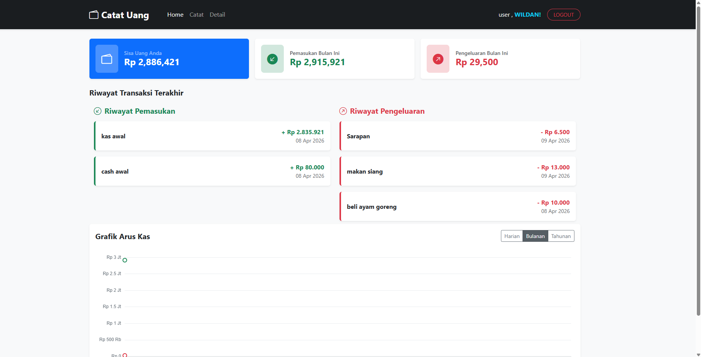

# 📊 Catat Uang - Personal Finance Tracker


**Catat Uang** adalah sebuah aplikasi web responsif yang dirancang untuk membantu pengguna melacak arus kas pribadi mereka. Aplikasi ini memungkinkan pengguna untuk mencatat pemasukan, pengeluaran, mengelola kategori, dan memantau kesehatan finansial melalui dashboard yang interaktif.

> **📖 Catatan Historis Belajar:** > Proyek ini dibangun dari awal (scratch) sebagai bagian dari perjalanan belajar saya sebagai Web Developer. Melalui proyek ini, saya memperdalam pemahaman tentang **PHP Native**, **Relational Database Design (MySQL)**, implementasi UI/UX menggunakan **Bootstrap 5**, serta manipulasi DOM dan visualisasi data menggunakan **JavaScript & Chart.js**. Proyek ini adalah tonggak penting dalam karir _development_ saya.

---

## 📸 Preview Aplikasi



---

## ✨ Fitur Utama

- **🔐 Sistem Autentikasi Solid**: Fitur Login, Registrasi, dan Logout yang aman (dengan pemisahan _role_ Admin & User).
- **📈 Dashboard Interaktif**: Menampilkan sisa saldo, total pemasukan/pengeluaran bulan ini, dan riwayat transaksi terakhir.
- **📊 Visualisasi Data (Chart.js)**: Grafik arus kas yang bisa di-filter berdasarkan harian, bulanan, dan tahunan.
- **🗂️ Manajemen Kategori (CRUD)**: Pengguna dapat membuat kategori khusus untuk _income_ atau _expense_.
- **💸 Pencatatan Transaksi (CRUD)**: Mencatat detail transaksi lengkap dengan nominal, tanggal, kategori, dan catatan tambahan.
- **🔔 Interactive Alerts**: Notifikasi aksi (simpan, edit, hapus) yang elegan menggunakan **SweetAlert2**.

---

## 🛠️ Tech Stack & Libraries

Aplikasi ini dibangun menggunakan teknologi web standar tanpa _framework backend_ besar, untuk memastikan pemahaman pondasi yang kuat:

- **Frontend**: HTML5, CSS3, Vanilla JavaScript (ES6)
- **UI Framework**: [Bootstrap v5.3](https://getbootstrap.com/) & Bootstrap Icons
- **Backend**: PHP Native
- **Database**: MySQL / MariaDB (`db_pencatatan_keuangan`)
- **Libraries**:
  - [Chart.js](https://www.chartjs.org/) - Untuk render grafik arus kas.
  - [SweetAlert2](https://sweetalert2.github.io/) - Untuk pop-up notifikasi yang modern.

---

## 🗄️ Struktur Database (ERD)

Aplikasi ini menggunakan 3 tabel utama yang saling berelasi (`Relational Database`):

1. **`tbmaster_users`**: Menyimpan data pengguna (`user_role`, `username`, `email`, `password`).
2. **`tbmaster_categories`**: Berelasi dengan _users_ (`cat_userid`), menyimpan daftar kategori transaksi (`income`/`expense`).
3. **`tbtr_transactions`**: Tabel transaksi inti yang berelasi dengan _users_ dan _categories_, menyimpan detail `tr_type`, `tr_nominal`, dan `tr_date`.

---

## 🚀 Cara Instalasi & Menjalankan Lokal

Buat kamu yang ingin mencoba menjalankan project ini di komputer lokal:

1. **Clone Repository ini**
   ```bash
   git clone git@github.com:hakkuryuu7z/Pencatatan-keuangan.git
   Pindahkan ke Server Lokal
   Pindahkan folder proyek ke dalam direktori server lokal kamu (misal: htdocs untuk XAMPP, atau www untuk Laragon).
   ```

Setup Database

Buka phpMyAdmin (biasanya di http://localhost/phpmyadmin).

Buat database baru dengan nama db_pencatatan_keuangan.

Import file db_pencatatan_keuangan.sql (jika kamu menyediakannya di root folder) ke dalam database tersebut.

Konfigurasi Koneksi

Buka file config/database.php.

Pastikan credentials sesuai dengan database lokalmu (biasanya user: root, password: ).

Jalankan Aplikasi

Buka browser dan ketikkan http://localhost/CATAT_UANG.

📂 Struktur Direktori Utama
Plaintext
CATAT_UANG/
├── assets/ # Library pihak ketiga (Bootstrap Icons, Chart.js, SweetAlert) & Custom CSS/JS
├── auth/ # Logika & Tampilan untuk Login/Register
├── Catat/ # Modul input transaksi baru
├── categories/ # Modul CRUD Master Kategori
├── config/ # Konfigurasi database utama
├── dashboard/ # Halaman utama setelah login & Logika Chart
├── Detail/ # Modul manajemen transaksi (Edit, Hapus, View)
├── templates/ # Potongan layout (Header, Navbar, Footer, Scripts)
├── transactions/ # Halaman riwayat semua transaksi
└── index.php # Entry point / Routing dasar
👨‍💻 Author
Dikembangkan dengan ☕ oleh:
Wildan | Web Developer

GitHub: @hakkuryuu7z

Email: muhammadwildansafrudin@gmail.com

Jika proyek ini membantumu belajar atau kamu menyukainya, jangan lupa beri ⭐ di repository ini!
